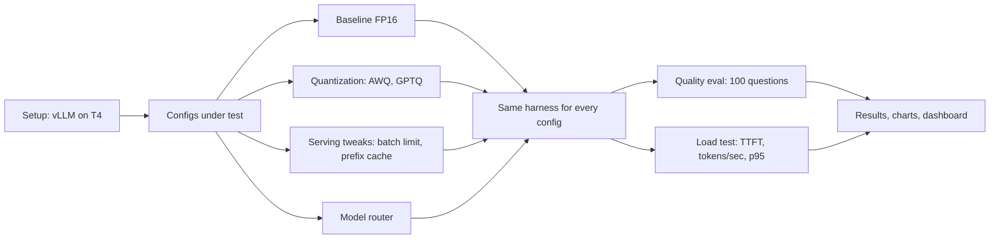

# Inference Optimization Lab

**How much faster and cheaper can a small open LLM be served, and what does each optimization cost in answer quality?**

This project serves Qwen2.5 models with [vLLM](https://github.com/vllm-project/vllm) on a free cloud T4 GPU. It changes one thing at a time (4-bit quantization, scheduler settings, prefix caching, a small/large model router) and measures every config the same way: a 100-question quality eval and a concurrency load test.

Nothing here is estimated. Every number comes from the CSV files in [`results/`](results/).

## Pipeline



## What is measured

| Metric | How |
|---|---|
| Quality | 100 questions scored by code, no LLM judge: 40 math (GSM8K), 30 knowledge (MMLU), 30 JSON extraction. Temperature 0, 768 max tokens. |
| Throughput | Tokens/sec at concurrency 1, 4, 16, 32 |
| Responsiveness | Time to first token (TTFT) p50 / p95 |
| Tail latency | Request latency p50 / p95 / p99 |
| Cost | GPU $/hr divided by (tokens/sec x 3600), per 1M tokens. Assumes full utilization; the GPU price is an input you set. |
| Truncation | Count of eval answers that hit the token limit (real `finish_reason`) |

Load test: 48 requests per run, 3 repeats per concurrency level, 128 forced output tokens, warm-up discarded. A run with failed requests is invalid.

## Configs

| Config | Change from baseline |
|---|---|
| `baseline` | Qwen2.5-1.5B-Instruct, FP16 |
| `awq`, `gptq` | 4-bit weights, same model family |
| `seqs16`, `seqs128` | Scheduler batch limit (`--max-num-seqs`) |
| `prefix_off_shared`, `prefix_on_shared` | Prefix caching, tested with a long shared system prompt |
| `small` + router | Qwen2.5-0.5B-Instruct plus a TF-IDF / logistic-regression classifier that decides which questions go to the small model |

## Key findings

These are the observations from my runs. The full table is in `results/RESULTS.md`; check any number below against `results/summary.csv`.

**1. 4-bit quantization did not make serving faster on a T4.**
At concurrency 16, AWQ reached about 345 tokens/sec and GPTQ about 359, versus about 385 for the FP16 model. Quality was 67/100 (AWQ) and 69/100 (GPTQ). My hypothesis is that for a model this small, dequantization overhead cancels the memory savings, but I have not isolated that cause. The benefit of quantization here is memory, not speed (see `results/mem_*.txt`).

**2. A low batch limit hurts tail latency under load.**

| Concurrency 32 | Tokens/sec | TTFT p50 | Request latency p95 |
|---|---|---|---|
| `--max-num-seqs 16` | about 386 | about 5.5 s | about 11.2 s |
| `--max-num-seqs 128` | about 540 | about 0.2 to 0.3 s | about 6 to 7 s |

With a limit of 16, half the requests wait in a queue, so throughput stops growing and the first token takes over 5 seconds. At concurrency 16 the two settings are equal, because 16 requests fit under either limit.

**3. The eval has limited resolution.** With 100 questions (30 to 40 per category), a difference of a few questions is within noise. I treat the quantization quality drop as small, not precise.

### Results table

| Config | Quality (of 100) | Tokens/sec at concurrency 16 |
|---|---|---|
| baseline (FP16) | _fill from `results/summary.csv`_ | _fill_ |
| awq | 67 | about 345 |
| gptq | 69 | about 359 |
| FP16, `max-num-seqs 128` | not evaluated (weights unchanged) | about 385 |
| FP16, `max-num-seqs 16` | not evaluated (weights unchanged) | about 388 |

## Which config when

_Write this from your own numbers: which config you would deploy for lowest latency, lowest cost, and highest quality, and the quality cost you accepted._

## Repository layout

```
notebooks/inference_lab.ipynb   end-to-end notebook (runs every step)
bench/                          build_eval.py, scoring.py, run_eval.py, loadtest.py, eval.jsonl
serve/baseline.md               exact baseline server command and notes
results/                        CSVs, charts, RESULTS.md (see results/README.md)
app/                            Streamlit dashboard that reads results/
Dockerfile                      serves the chosen config with the vLLM OpenAI image
```

## Reproduce

1. Open `notebooks/inference_lab.ipynb` in Google Colab (or the Kaggle version) with a **T4 GPU** runtime.
2. Run the cells top to bottom; restart the session once after the install cell.
3. Results are saved after each config. If the session disconnects, re-run the setup cells; finished configs are skipped.

Do not mix numbers from different platforms in one table (vLLM version, CUDA and GPU host can differ). `results/env.txt` records the Python, vLLM, torch and GPU used.

## Dashboard

```bash
pip install -r app/requirements.txt
streamlit run app/app.py
```

Shows speed, quality, cost and router views from `results/`. Put your own conclusions in `results/findings.md` and they appear on the Overview tab.

## Tech stack

Python, vLLM, PyTorch, Hugging Face datasets, scikit-learn, pandas, matplotlib, Streamlit, Docker.

## Limitations

- Small eval set (100 questions); differences of a few questions are within noise.
- Free cloud T4 GPU can be shared or throttled; results are from one GPU type.
- `--enforce-eager` is used for every config, so absolute speeds are lower than a fully tuned setup.
- Steady synthetic load with fixed output length, not real bursty traffic.
- Math scoring falls back to the last number in the answer when no `Answer:` line is present. This applies equally to every config.
- The router is evaluated offline from stored outputs, and its cost ignores hosting two models.
- Cost figures depend on an assumed GPU price and full utilization.

## What I would do next

- A larger eval set and a larger model (7B) on a bigger GPU.
- Enable CUDA graphs to test whether quantization speedups appear.
- Test with a realistic request mix instead of a steady load.